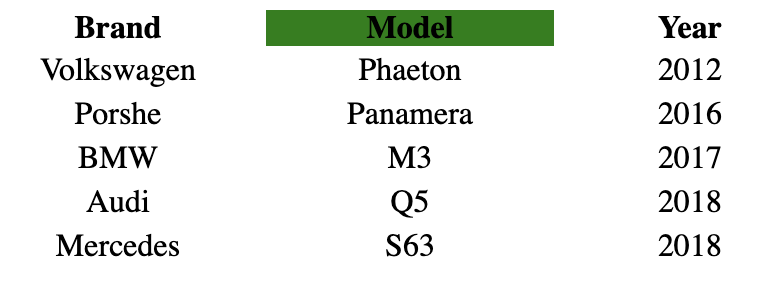

# Sort table

## Task

Sort the table by clicking on the header.

Requirements:

- Use delegation.
- The code should not change as the number of columns or rows increases.

It's may be helpful - [navigation](https://learn.javascript.ru/traversing-dom#dom-navigation-tables)

### Screenshot of the tree

---
**Read the guideline before start**

[Guideline](https://github.com/mate-academy/js_task-DOM-guideline)

**Result**

- [UPDATE DEMO LINK](https://<your_account>.github.io/<repo_name>/)
